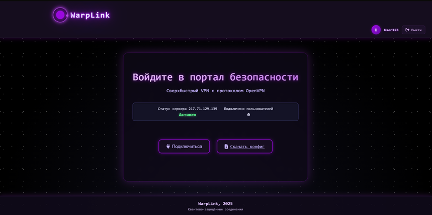
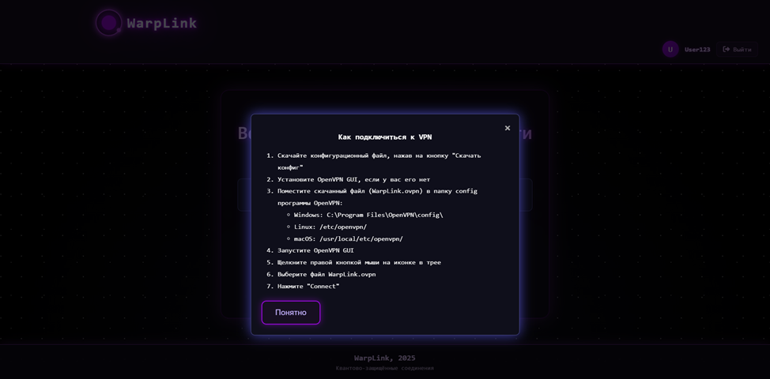
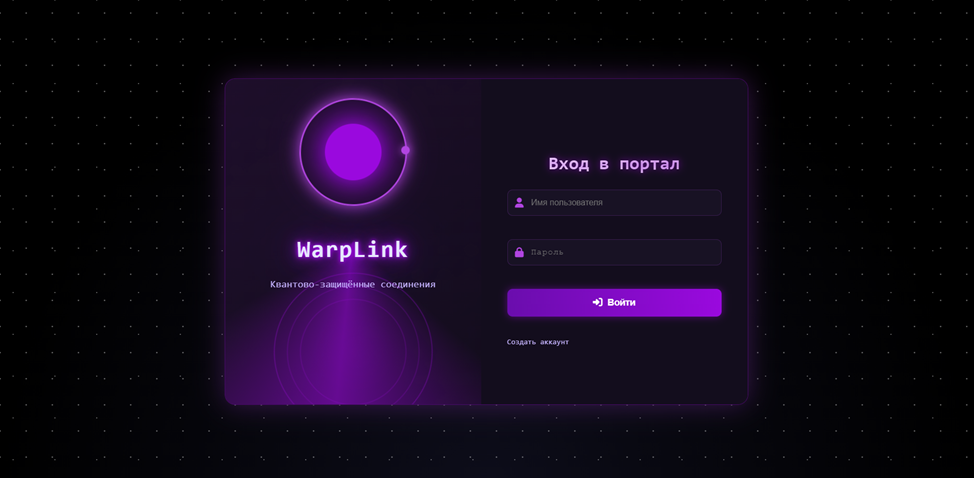
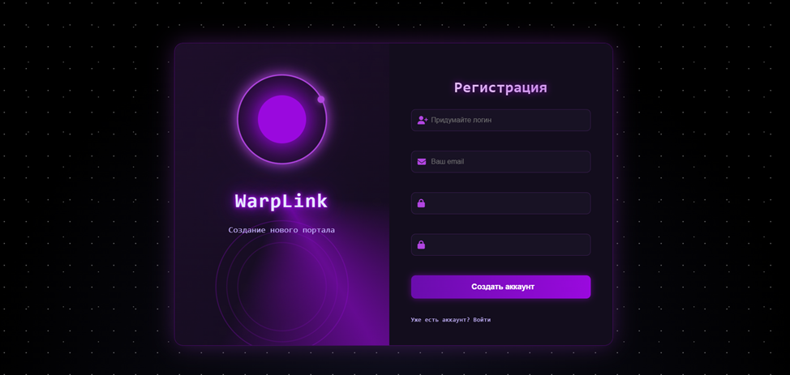

# WarpLink

**WarpLink** – это веб-приложение для управления VPN-сервисом на базе технологии OpenVPN. Основная цель системы – предоставить пользователям возможность безопасного подключения к интернету через зашифрованные туннели без необходимости сложных технических настроек. Приложение позволяет регистрировать новых пользователей, аутентифицировать существующих, отслеживать состояние VPN-сервера в реальном времени и скачивать конфигурационные файлы для быстрой настройки клиентского программного обеспечения.

## Установка

1. Установить репозиторий:

```
git clone git@github.com:fratellou/WarpLink.git
```

2. Перейти в директорию проекта:

```
cd WarpLink/WarpLink/
```

3. Установить зависимости:

```
pip install -r requirements.txt
```

4. Создать переменные окружения в файле .env (пример переменных окружения представлен в файле .env.example).

5. перейти в директорию ниже:

```
cd WarpLink/
```

6. Применить миграции:
```
python3 manage.py migrate
```

7. Запустить сервер:

```
python3 manage.py runserver
```

8. Перейти в *http://127.0.0.1:8000/*

## Макет проекта и пользовательские сценарии

Пользовательский интерфейс включает главную страницу с анимированным порталом, отображающим статус сервера и количество активных подключений, а также специализированные страницы для регистрации и входа. Неавторизованные пользователи могут просматривать общую информацию о сервисе, проверять статус VPN-сервера и регистрировать новые учетные записи. После успешной аутентификации пользователи получают доступ к функции скачивания конфигурационного файла, необходимого для настройки OpenVPN-клиента на их устройствах.









## Функциональные требования

Ключевым функциональным требованием является безопасная аутентификация пользователей через кастомные формы с валидацией данных на стороне сервера. Система требует обязательной проверки уникальности email при регистрации и надежной защиты паролей с использованием современных алгоритмов хеширования. 
Авторизация реализована через механизм сессий Django с разделением прав доступа – скачивание конфигурационных файлов доступно только аутентифицированным пользователям. 
Тестирование функционала включает проверку корректности SSH-подключений к VPN-серверу, валидацию данных форм регистрации и входа, а также тестирование отказоустойчивости при недоступности удаленного сервера. 
Дополнительные требования включают автоматическое обновление статуса сервера на клиентской стороне.

## Архитектура проекта

Серверная часть приложения построена на фреймворке Django с использованием классической MVT-архитектуры. Основной бизнес-логика реализована в модулях views, где происходит обработка HTTP-запросов, взаимодействие с VPN-сервером через SSH-протокол и генерация динамического контента. 
Для обеспечения безопасности применяются механизмы CSRF-защиты, валидация входных данных и хранение чувствительной информации в переменных окружения. 
Клиентская часть использует HTML5-шаблоны с каскадными таблицами стилей, включающими сложные анимации портала, и JavaScript для динамического обновления данных. Взаимодействие между клиентом и сервером организовано через AJAX-запросы для получения статуса сервера без перезагрузки страницы.
Безопасность соединения в OpenVPN обеспечивается инфраструктурой открытых ключей (PKI), включающей многоуровневую систему сертификатов.

## Описание ключевых энд поинтов в API

Система содержит несколько конечных точек. Корневой энд поинт обеспечивает перенаправление на главную страницу или страницу входа в зависимости от статуса аутентификации пользователя. Энд поинт статуса сервера предоставляет данные о текущем состоянии VPN-сервера и количестве активных подключений в формате JSON. Точка скачивания конфигурации отвечает за передачу конфигурационных файлов аутентифицированным пользователям. Энд поинты аутентификации включают отдельные маршруты для входа в систему, регистрации новых пользователей и выхода из системы. 

---
> fratellou, 2025